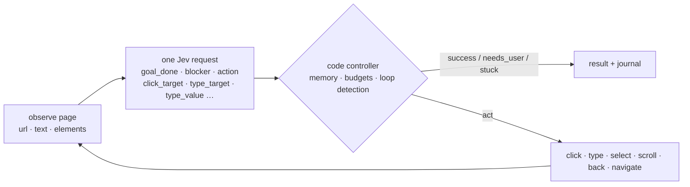

<p align="center">
  
</p>

<h1 align="center">jev-browser</h1>

<p align="center">
  <b>Browser use &amp; computer use for coding agents, powered by TypeSafe Jev.</b><br>
  Calibrated judgments from a System One model. Control loop in code. No vision model, no prompt-and-parse.
</p>

<p align="center">
  <a href="https://github.com/ChenYCL/jev-browser-skill/actions/workflows/test.yml"></a>
  
  
  
  
  
</p>

<p align="center">
  <b>English</b> · <a href="README.zh-CN.md">简体中文</a>
</p>

<p align="center">
  
</p>

---

## Demo

Real runs in **ego lite**, recorded by the tool itself (`run --step-screenshots`). Left: the page
exactly as Jev saw it before each step. Right: Jev's calibrated judgment for that step and the
action the code controller executed. Every demo is a single `jev-browser run` command.

**Wikipedia, multi-hop on a real site** — type into the search box and press Enter, pick the right
result, follow links across three articles (a 500-link page: goal-aware candidate ordering keeps the
relevant links in the list). 6 steps · $0.0029 · 21 s.
[▶ MP4 1080p](assets/demo-wikipedia.mp4)

<p align="center">
  
</p>

**Sign in with a secret, then fill a form with a dropdown** — the password is typed but shown to
Jev only as `inputs.password`; the topic is chosen from the dropdown's options in a second
question. 10 steps · $0.0013 · 18 s. [▶ MP4 1080p](assets/demo-form.mp4)

<p align="center">
  
</p>

**Three identical "Start free trial" buttons** — the goal names the Team plan; Jev picks the right
button from page structure alone at probability 1.00. 3 steps · $0.0003 · 3 s.
[▶ MP4 1080p](assets/demo-team-plan.mp4) · Bonus: [GitHub repository navigation (MP4)](assets/demo-github.mp4)

<p align="center">
  
</p>

GitHub does not play repository MP4s inline, so the GIFs above are previews; the MP4s are the
full-quality recordings (1080p, crossfades). Reproduce any of them with
`node scripts/make-demo.mjs <run.json> out.mp4 --gif out.gif` after a run made with `--step-screenshots <dir>`.

## Why

| | |
| --- | --- |
| **Works in the user's browser** | Default backend is [ego lite](https://ego.dev): the agent reuses your signed-in sessions, and hands the browser to you when it hits a login, CAPTCHA or consent wall. Resume from the same tab afterwards. |
| **Calibrated, not chatty** | Jev returns probabilities, not prose. Every decision is a number you can threshold, journal and tune. A step costs about **$0.0003** and takes about a second. |
| **Never invents text** | Values that must be typed come from `inputs`; Jev only *selects* among them. `secrets` are typed but never sent to the model or written to disk. |
| **Code stays in control** | Legal actions are filtered in code, tried/blocked edges are remembered, loops are detected, step/cost/time budgets are enforced, and the final page is verified before reporting success. |
| **Fits every agent** | One self-contained skill directory. CLI for Claude Code, Codex, Cursor and any shell-capable agent; a dependency-free **MCP server** for Claude Desktop, Cursor and Codex. |
| **Nothing to install** | Node 22+ and a `TYPESAFE_API_KEY`. Zero npm dependencies. |

## How it works



Per step, one `POST /v1/systemone` carries the page state and the questions below. They are
independent and evaluated in parallel, so speculative ones are asked up front and consumed only
when relevant.

| question | type | used by code as |
| --- | --- | --- |
| `goal_done` | noul | success when ≥ 0.85 (≥ 0.7 on the final verification pass) |
| `blocker` | choice: none · login_required · verification_challenge · consent_or_permission_dialog · error_page · missing_information | `needs_user` when a non-none option ≥ 0.6 |
| `action` | choice over the **legal** actions only (click · type · select · scroll · go_back · navigate · wait · stop) | preference order |
| `click_target` / `type_target` / `select_target` | choice over element ids + `none` | which element |
| `type_value` | choice over input keys + `none` | which provided value |
| `submit_after_type` | noul | press Enter after typing |
| `progress` | score: moved away · no change · closer · accomplished | go back on regression |

Full details: [`references/questions.md`](skills/jev-browser/references/questions.md).

## Quick start

```bash
git clone https://github.com/ChenYCL/jev-browser-skill.git && cd jev-browser-skill
export TYPESAFE_API_KEY=...        # https://console.typesafe.ai
node skills/jev-browser/bin/jev-browser.mjs doctor      # key, API, ego lite, Chrome, Safari, install status
node skills/jev-browser/bin/jev-browser.mjs install     # link into every agent + register Claude Desktop MCP
```

Optional: `npm i -g .` puts `jev-browser` on your `PATH` (the examples below assume it).

## Install into your agents

`install` is idempotent, previews with `--dry-run`, backs up every file it edits and reverts with `--uninstall`.

| target | what it does | default |
| --- | --- | :---: |
| `claude-code` | symlink `~/.claude/skills/jev-browser` | ✔ |
| `codex` | symlink `~/.codex/skills/jev-browser` | ✔ |
| `agents` | symlink `~/.agents/skills/jev-browser` (skills.sh convention: Codex, opencode, Gemini CLI, …) | ✔ |
| `cursor` | symlink `~/.cursor/skills/jev-browser` | ✔ |
| `claude-desktop` | `mcpServers.jev-browser` in `claude_desktop_config.json` | ✔ |
| `cursor-mcp` | `mcpServers.jev-browser` in `~/.cursor/mcp.json` | |
| `codex-mcp` | `[mcp_servers.jev-browser]` in `~/.codex/config.toml` | |

```bash
jev-browser install --targets claude-code,claude-desktop --dry-run
```

Other routes:

- **Claude Code plugin**: `claude plugin marketplace add ChenYCL/jev-browser-skill` then `claude plugin install jev-browser@jev-browser-skill`
- **skills.sh**: `npx skills add ChenYCL/jev-browser-skill --skill jev-browser`
- **Manual**: copy `skills/jev-browser/` anywhere your agent reads skills from.
- **Windows**: prefer `install --copy` (symlinks need Developer Mode or elevation).

MCP hosts start servers without your shell environment, so the installer stores the key in
`~/.config/jev-browser/config.json` (mode 0600) when `TYPESAFE_API_KEY` is exported. Restart the host afterwards.

## Usage

```bash
# navigate
jev-browser run --goal "Open the pricing page" --url https://example.com

# type a provided value, then press Enter (Jev decides when Enter is the natural submit)
jev-browser run --goal 'Search the catalog for "blue widget" and open its product page' \
  --url https://shop.example.com --input query="blue widget"

# sign in: the email is an input, the password is a secret (typed, never sent to the model)
jev-browser run --goal "Sign in and reach the dashboard" --url https://app.example.com/login \
  --input email=ada@example.com --secret password=hunter2

# dedicated headless Chrome, JSON result only
jev-browser run --goal "Add the Red Gadget to the cart" --url https://shop.example.com \
  --backend chrome --headless --json --screenshot /tmp/cart.png

# look before acting: the page exactly as Jev sees it / the first-step questions without spending a request
jev-browser observe --url https://example.com --json
jev-browser run --dry-run --goal "…" --url https://example.com

# raw Jev judgments, browser-independent
jev-browser judge --state '{"ticket":"My card was charged twice"}' \
  --questions '{"refund":{"type":"noul","instructions":"Does `ticket` ask for a refund?"}}'
jev-browser pick --question "Which link opens the plans page?" --candidate pricing="link 'Pricing'" --candidate docs="link 'Docs'"
```

Tips that matter: write goals in English describing the **end state**; put everything that
must be typed in `--input` (quoted strings in the goal are added automatically); use `--secret`
for credentials.


### CLI reference

| command | purpose |
| --- | --- |
| `run` | accomplish a goal (`--goal`, `--url`, `--input k=v`…, `--secret k=v`…) |
| `observe` | print the page as Jev sees it (`--url`, `--screenshot`) |
| `judge` | raw System One call (`--state` / `--state-file`, `--questions` / `--questions-file`, `--model`) |
| `pick` | one Choice over named candidates (`--question`, `--candidate id=desc`…, `--context`, `--no-none`) |
| `doctor` | environment check (`--offline` skips the live API probe, `--json`) |
| `config` | `show` · `path` · `set <key.path> <value>` · `unset <key.path>` · `set-key [<key> \| --from-env]` |
| `install` | `--targets a,b` · `--dry-run` · `--copy` (copy instead of symlink; use on Windows) · `--uninstall` · `--home <dir>` |
| `mcp` | MCP server over stdio |

`run` options: `-g/--goal` · `-u/--url` · `-i/--input` · `-s/--secret` · `-b/--backend ego\|chrome\|safari` ·
`--max-steps` · `--budget-usd` · `--max-ms` · `--model` · `--space-id` and `--page-label` (ego: resume a
task space) · `--keep` / `--no-keep` (leave the final page open; default keep on success) · `--headless` ·
`--cdp-url` (chrome: attach) · `--screenshot <file>` · `--step-screenshots <dir>` (one PNG per step, the page as Jev saw it) · `--dry-run` · `--journal-dir <dir>` · `--no-journal` ·
`--json` · `-q/--quiet`. `jev-browser --help` prints the same list.

### Results

| status | meaning | exit |
| --- | --- | :---: |
| `success` | goal verified on the final page | 0 |
| `needs_user` | blocker detected; on ego the tab was handed to you. Continue with `--space-id <id>` | 3 |
| `stuck` | repeated no-effect actions, a loop, or Jev judged nothing listed helps | 2 |
| `max_steps` · `budget_exhausted` · `timeout` | a limit was hit (`--max-steps 25`, `--budget-usd 0.25`, `--max-ms 300000`) | 2 |
| `error` | backend or API failure | 2 |

Every run writes `<journalDir>/<runId>/steps.jsonl` (state hash, compact answers, chosen action,
whether the page changed, cost), `requests.jsonl` and `run.json`, with secrets redacted.

### Backends

| backend | when | notes |
| --- | --- | --- |
| `ego` (default) | you want the agent in **your** browser with your logins, and the option to take over | keeps the result tab open on success; `handOff` on blockers; resume with `--space-id` |
| `chrome` | unattended runs, CI, no window | own profile dir, `--headless`, or `--cdp-url http://127.0.0.1:9222` to attach |
| `safari` | WebKit | enable Develop → Allow Remote Automation once |

### Judging tiers

Three judging backends serve the same `/v1/systemone` contract, and all three are first-class
options — but **hosted Jev is the default**: with no config file and no environment, a run uses
`https://api.typesafe.ai` (and a loopback `baseUrl` — a local model — is priced at $0).

```bash
jev-browser tier list      # the three tiers: what each is, what it needs, how to start it, its port, its score, its bar
jev-browser tier status    # what a run would use right now: baseUrl, tier, resolved goal_done bar, endpoint
jev-browser tier use kev   # one tier's export line and start command (nothing is written unless you add --persist)
```

The GGUF readout (`node skills/jev-browser/bin/jev-local.mjs`, port 8092) needs no Python and
serves an Apple Silicon `llama.cpp` server; Kev (`node skills/jev-browser/bin/jev-kev.mjs`, port
8008) trades a Python venv, a 9.34 GB base and tens of GB of GPU memory for the accuracy tier. The
The tier table with every measured number — scores, latency, disk, memory, each backend's `goal_done`
bar and the known holes — also lives in [SKILL.md](skills/jev-browser/SKILL.md#judging-tiers).

A local tier is one command: `setup` fetches whatever is missing through the launcher itself, starts
the server in the background, writes `baseUrl` and the placeholder key into your config, then proves
the endpoint works by asking it one real question.

```bash
jev-browser setup local-readout   # llama.cpp + the registry GGUF; prints the log path and the pid
jev-browser setup status          # installed / running / configured, per local tier
jev-browser setup stop local-readout
```

`jev-browser setup kev` is the same for the accuracy tier and needs `uv` as well (it clones the Kev
checkout and runs `uv sync --extra serve`). Both write under `~/.jev-browser/`, never into this repo.
The manual route still exists — start `bin/jev-local.mjs` yourself and export the two variables it
prints — and `jev-browser tier use <tier> --persist` still stores that line's values for you.

## Judging backends: measured comparison

The same 20 graded items, the same real captured fixture step, and the same harness for every
backend; the run-level lines come from one campaign of 15 real browser runs. Every figure below is
read from this repo's own records — [`experiments/gguf-provider/RESULTS.md`](experiments/gguf-provider/RESULTS.md),
[`experiments/gguf-provider/results/local-models-4b.md`](experiments/gguf-provider/results/local-models-4b.md),
[`experiments/kev-4b/README.md`](experiments/kev-4b/README.md),
[`docs/local-kev-bringup.md`](docs/local-kev-bringup.md),
[`docs/local-backend-run-smoke.md`](docs/local-backend-run-smoke.md) and the raw JSON under
`experiments/gguf-provider/results/`. `not measured` means the record is silent about that cell;
`—` means the item does not exist for that backend. **Hosted Jev remains the default**, and its
0.95 is the number every local backend is measured against.

### Accuracy — 20 graded items, ground truth known by construction

| backend | all 20 | browser 15 | noul 5 | action + click_target 5 |
| --- | --- | --- | --- | --- |
| **hosted Jev** — `jev-latest` → `jev-1.13.0`, the default | **19/20 = 0.95** | 14/15 = 0.933 | 5/5 = 1.00 | 5/5 = 1.00 |
| **Kev 4B** — `jaredpalmer/kev-4b`, T=2.1435, `--row-limit 16384` | **19/20 = 0.95** | 14/15 = 0.933 | 5/5 = 1.00 | 5/5 = 1.00 |
| Kev 4B — same checkpoint, published row limit 8192 | 18/20 = 0.90 | 13/15 = 0.867 | 5/5 = 1.00 | 4/5 = 0.80 |
| **GGUF 4B** — `Qwen3.5-4B Q4_K_M`, the `setup local-readout` default | 16/20 = 0.80 | 12/15 = 0.80 | 4/5 = 0.80 | 2/5 = 0.40 |
| Qwen3-4B-Instruct-2507 Q4_K_M | 15/20 = 0.75 | 10/15 = 0.67 | 5/5 = 1.00 | 1/5 = 0.20 |
| gemma-3-4b-it Q4_K_M | 10/20 = 0.50 | 7/15 = 0.47 | 3/5 = 0.60 | 1/5 = 0.20 |
| Kev 0.8B — `jaredpalmer/kev-0.8b`, T=2.41 | 14/20 = 0.70 (14 of 19 answerable) | 9/15 = 0.60 | 5/5 = 1.00 | 3/5 = 0.60 |
| GGUF 0.8B — `Qwen3.5-0.8B Q8_0` | 10/20 = 0.50 | 7/15 = 0.47 | 3/5 = 0.60 | 1/5 = 0.20 |
| "always answer the option listed first" — trivial baseline | 11/20 = 0.55 | 9/15 = 0.60 | 2/5 = 0.40 | 2/5 = 0.40 |

Two rows carry a caveat: **Kev 4B reaches 0.95 only with the optional row-limit patch** (at the
published 8192 the 55-option `click_target` question is refused with HTTP 422, which is the one item
that separates the two Kev 4B rows); and **`ddg-click-target-aapl`'s hand label is debatable** — the
label is `e1` (investing.com, `in_viewport=false`) while hosted Jev, the GGUF 4B and gemma all pick
`e15` (Yahoo Finance's AAPL quote page, in viewport), so every one of those is scored down by up to
one item on that question.

### What it costs to run

| backend | per item, mean / max | disk | memory | cost |
| --- | --- | --- | --- | --- |
| **hosted Jev** | 621 / 1,270 ms | nothing to download | not measured | $0.0035 for the 20 items (`ceiling-jev-20items.json`) |
| Kev 4B @16384 | 2,223 / 12,183 ms | 9.34 GB base + 152 MiB checkpoint | 18–19 GB idle, **36 GB** GPU footprint after a full pass | $0 |
| Kev 4B @8192 | 1,965 / 8,995 ms | the same two files | 18–19 GB idle, 12.2 GiB RSS peak during the pass | $0 |
| GGUF 4B | 3,072 / 13,895 ms | 2,740,937,888 B (2.6 GiB) | 3,362 MiB (`llama-server` RSS) | $0 |
| Qwen3-4B-Instruct-2507 | 2,514 / 15,386 ms | 2,497,281,120 B | not measured | $0 |
| gemma-3-4b-it | 2,189 / 9,725 ms | 2,489,894,016 B | not measured | $0 |
| Kev 0.8B | 590 / 6,353 ms | 1.72 GiB (base + LoRA + tokenizers + head) | 3.6 GiB RSS peak at 16384 (21–129 MiB idle) | $0 |
| GGUF 0.8B | 777 / 4,178 ms | 811,843,840 B (774 MiB) | not measured | $0 |
| trivial baseline | — | — | — | $0 (no model) |

The latencies are not all one measurement, so read them with these three notes: the GGUF 4B and
gemma rows were timed **while a download was still running**, which makes them read pessimistic (the
GGUF 4B re-measured clean is **18.3 s cold / 9.0 s warm** for the whole 5-question step, and 6.1 s of
that is the 55-option `click_target` alone); Kev 4B's per-item figures likewise include that
55-option item (12.2 s of its 12,183 ms worst case); and a **packed** 5-question fixture step costs
23.8 s at the raised Kev limit (12,073 input tokens) but is refused outright at 8192. `$0` is not a
rounding: a loopback `baseUrl` is priced at zero by the client. Memory for Kev 4B is the real
constraint — reading **`footprint`**, not `ps -o rss=`, is what shows the 36 GB, and on this 48 GB
machine the raised limit drove swap from 16.7 GB to 28.3 GB used (416 MB free) during a full pass,
without a single request timing out.

### How this was measured

- **20 graded items with ground truth known by construction.** 15 browser items (each with the
  expected element id / action) + 5 passage yes/no items; the label is written into the item, not
  produced by a model.
- **A real captured-page step.** `experiments/gguf-provider/fixtures/judge-state.json` plus
  `judge-questions.json` replay one genuine browser step — the product's own 5-question request
  (`goal_done`, `blocker`, `action`, a 55-option `click_target`, `select_target`) on a real page.
- **A rotation probe.** The same option list is re-rendered at three rotations while the labels stay
  put, so "reads the text" and "reads the position" are distinguishable: the GGUF 4B hits the
  expected element at every rotation (k=0/3/7 → `e8`/`e5`/`e1`, P≈0.99), the 0.8B keeps answering
  inside the first few slots.
- **One harness per backend, one machine for all the local numbers.** The GGUF candidates run
  through `experiments/gguf-provider/eval/run.mjs`; Kev is graded by `experiments/kev-4b/run.mjs` on
  the same items and the same fixture step, over the same `/v1/systemone` client path hosted Jev used
  (`lib/typesafe.mjs`), behind a preflight that refuses to run unless the served checkpoint equals
  `--run` — a wrong model cannot be scored silently. Everything local was measured on one Apple
  Silicon machine: M3 Max, 48 GB, macOS 25.6.0 arm64.

### The 15 real browser runs

The shipped GGUF readout actually driving `jev-browser run` — goals, journals and per-step numbers in
[`docs/local-backend-run-smoke.md`](docs/local-backend-run-smoke.md):

- **Outcomes: 4 `success` · 8 `stuck` · 2 `needs_user` · 1 `max_steps` — zero `error`, zero
  `timeout`.** One run finished a real Wikipedia search goal in 4 steps. Of the two `needs_user`, one
  was a genuine CAPTCHA (true positive) and one a false `missing_information` on a plain pricing page.
- **The transport never broke:** 39 step requests, every one succeeded on its first attempt, 0 client
  timeouts, 0 HTTP 422 `LOW_LABEL_MASS`, lowest label mass 0.870 against a 0.5 threshold.
- **Strong half — element selection.** `click_target` was the most reliable question in the whole
  campaign: on a 65-element Wikipedia page it put the right link first at every step (0.71–0.78).
- **Weak half — the `action` question.** On the fixture login page it knew both where to type and what
  to type (`type_target` Email 0.851, `type_value` email 0.933) yet ranked `type` **last of four**
  (0.105 against click 0.430), so the controller spent three no-effect actions and gave up; three more
  runs chose `stop` with the goal one obvious click away. 8 of the 9 non-`success` runs stop on an
  `action` choice, which is why the controller — not the model — is where a local form-filling run has
  to be fixed.

### The `goal_done` bars, and why they differ

| backend | bar, per step / final | measured basis |
| --- | --- | --- |
| hosted Jev | **0.85 / 0.70** | the shipped value, on the scale hosted Jev is trained for. It does **not** transfer: scored as a termination rule over the same 15 local runs it gives 4 correct successes and **3 false `stuck`** (runs that had already finished reported as stuck) |
| GGUF readout (`local-readout`) | **0.174 / 0.174** | the same 15 runs replayed: pages that met the goal read 0.839–0.997, pages that did not read 0.007–0.096, and on the termination rule the usable band is 0.12–0.28 — 0.25 scores 7 correct successes / 0 false successes / 0 false `stuck` where 0.85 gives 4 / 0 / 3. 0.174 is that band's maximin midpoint |
| Kev 4B (`kev`) | **0.482 / 0.482** | the same 15 goals replayed against Kev 4B with the same method and scoring: its band is **(0.341, 0.683]**, so the readout's 0.174 would call four not-met pages a success and stop before the action that finished the goal; 0.482 is the midpoint of its clean band (any value in ~0.35–0.68 is clean) |

They differ because the three backends read the same question on scales that do not overlap — this is
a property of each backend, not a tuning preference, which is exactly why the bar is a **profile**
resolved from the endpoint (`thresholds.profile`, `auto` by default) rather than one global number.
A loopback endpoint is classified from one `GET /v1/models` at run start, and the profile, value and
reason are written to the run journal's `run.json` before the first step; `doctor` prints the result
under `goal_done bar`.

### Reproduce

```bash
# the 20 graded items + the label-rotation probe, against a local GGUF server on :8100
node experiments/gguf-provider/eval/run.mjs --url http://127.0.0.1:8100 --json
node experiments/gguf-provider/eval/run.mjs --url http://127.0.0.1:8100 --rotate --json

# the same 20 items and the fixture step against a Kev server on :8008
TYPESAFE_API_KEY=local node experiments/kev-4b/run.mjs --run jaredpalmer/kev-4b

# the termination-rule replay over the 15 saved local runs
bash experiments/kev-4b/threshold-replay.sh /tmp/kev-threshold
node experiments/kev-4b/threshold-replay.mjs /tmp/kev-threshold
```

Raw JSON: **`experiments/gguf-provider/results/`** (per-model `eval-*.json`, `analysis-*.json`,
`fixture-step-*.json`, plus `ceiling-jev-20items.json` and `baseline-first-option.json`) and
**`experiments/kev-4b/results/`** (`eval-<label>.json`, `fixture-step-<label>.json`, per-item
`raw/<label>/`, and `threshold-replay/{runs.tsv,labels.json,score.txt,journal/}`).

## WebUI

```bash
node skills/jev-browser/bin/jev-webui.mjs          # prints http://127.0.0.1:8765/
node skills/jev-browser/bin/jev-webui.mjs --port 9000 --open
```

One page over the same skill, not a second implementation: the panels call the same `lib/tiers.mjs`,
`lib/doctor.mjs` and `lib/config.mjs` the CLI does — so they cannot disagree with `tier status`,
`doctor` or `config show` — and edits go to the same `~/.config/jev-browser/config.json`. Every
command it starts is one of this repo's own `bin/*.mjs` scripts, spawned with an argv array (never a
shell), so no field on the page can become a command.

The server binds **`127.0.0.1` only** — never `0.0.0.0`, so nothing on it is reachable from your
network — and no route returns your API key: the config panel shows only whether one is set, and
secrets typed into the Run panel are never echoed back into the page or the log pane.

| panel | what it does |
| --- | --- |
| Tiers | the three judging tiers — what each is, what it needs, its port, its 20-item score and its `goal_done` bar, hosted marked as the default — plus what a run would use right now, start/stop for the two local servers with their output streaming into the page, and `tier use`'s text (saving it to the user config is its own labelled button) |
| Config | the effective configuration with its sources, editable, with the diff a save produced and an unset for every key the user file sets |
| Doctor | `doctor()` live or offline: every check with its status, detail and hint |
| Models | the local registry: which GGUF is downloaded, which is the default, which file is serving, and a one-click start with `--model-name` or an existing on-disk `--model <path>` |
| Judge | a state and a question set against the configured endpoint, with each answer's choice, confidence and probability table |
| Run | a real run (`jev-browser run --json`) with live progress, the final status / steps / cost and the per-step journal |

## MCP server

`jev-browser mcp` speaks MCP over stdio with zero dependencies. Tools: `jev_browse`, `jev_observe`,
`jev_judge`, `jev_pick`, `jev_doctor`, `jev_config`. Results come back as JSON text and
`structuredContent`. See [`references/mcp.md`](skills/jev-browser/references/mcp.md).

## Configuration

Precedence: defaults → `~/.config/jev-browser/config.json` → `./jev-browser.config.json` (or
`$JEV_BROWSER_CONFIG`) → environment → flags.

```bash
jev-browser config show
jev-browser config set model jev-1.13.0            # pin the model version
jev-browser config set thresholds.goalDone 0.9     # stricter success
jev-browser config set-key --from-env              # persist the key for MCP hosts
```

Environment: `TYPESAFE_API_KEY` `TYPESAFE_BASE_URL` `TYPESAFE_DEFAULT_MODEL` `JEV_BROWSER_BACKEND`
`JEV_BROWSER_MAX_STEPS` `JEV_BROWSER_BUDGET_USD` `JEV_BROWSER_JOURNAL_DIR` `JEV_BROWSER_CHROME_CDP_URL`
`JEV_BROWSER_HEADLESS` `JEV_BROWSER_EGO_SERVER_NAME` `CHROME_PATH` (Chrome executable override)
`JEV_BROWSER_CONFIG` (explicit project config file). Every key is documented in
[`references/config.md`](skills/jev-browser/references/config.md).

## Tests and stability

```bash
npm test                      # unit + e2e; live Jev when TYPESAFE_API_KEY is set, else a local mock
npm run test:e2e:mock         # fully offline (needs Chrome)
JEV_BROWSER_TEST_SAFARI=1 npm run test:e2e   # also drive Safari
```

CI (`.github/workflows/test.yml`) runs the unit suite and the mock e2e suite on Ubuntu with headless Chrome;
the live suite is meant to be run locally, so no API key is ever needed in the cloud.

The e2e suite serves a fixture site (catalog, search, login, pricing/trial, cart, contact form
with a dropdown, long docs page, restricted area) and runs nine goal scenarios per backend:
navigation, search with typed input, login with a secret, choosing the right one of three
identical "Start free trial" buttons, add to cart, form + dropdown, scroll to reveal, hand-off on
a blocker, limits on an impossible goal, plus observe/dry-run, the CLI round-trip and ego
hand-off → resume. Tests never write outside the repo.

Measured on macOS with live Jev (2026-09-22):

| | |
| --- | --- |
| full suite | 54 passed, 0 failed, 5 skipped (Safari opt-in), ~40 s, three consecutive runs identical |
| per-scenario determinism | same status every run; step counts identical on ego, ±1 on two Chrome scenarios |
| cost | $0.00006–0.00094 per scenario run (always under $0.001), about $0.02 per full suite |
| line coverage | 87 % overall (controller 92 %, questions/config/util 100 %, observe 99.6 %) |

Real sites, first try, via ego lite: TypeSafe docs → the *Choice* page in 2 steps / 9 s / $0.0005;
GitHub → `docs/ATOMIC_PLANNING.md` in NanoJev in 4 steps / 23 s / $0.0016.

## What leaves your machine

Each step sends one request to `api.typesafe.ai` containing the goal, the non-secret `inputs`, and a
compact view of the current page: URL, title, headings, up to `observation.maxTextChars` (3000) of
visible text, the descriptions of listed interactive elements (role, name, href, placeholder,
current value), the previous page's excerpt and the last action. Nothing else is sent: no
screenshots, no cookies, no HTML, no `secrets` (their values are replaced by a fixed marker, and
password fields report `(hidden)`). Journals stay local under `journalDir` with secrets redacted.
TypeSafe states that API requests are not used for training; see their
[legal page](https://docs.typesafe.ai/legal). Pin a model version with `config set model jev-1.13.0`
if reproducibility matters.

## Design notes

- **Dynamic legal moves.** Like NanoJev's Snake controller, code filters the action set
  (no `scroll_down` at the bottom, no `type` without inputs) and the model breaks ties.
- **Edge memory.** `(page state, action)` pairs that produced no change are blocked; pairs
  already tried are deprioritised, so A → B → back → A does not repeat forever.
- **Select, don't generate.** Typed values, dropdown options and URLs are chosen from candidates
  supplied by code; Jev 1.13 reads literally and does not generate text.
- **Goal-aware candidates.** Before truncating to `observation.maxCandidates`, code ranks
  elements whose name or href mention goal/input keywords first, then viewport, then position, so a
  relevant link far down a long page is still offered. Keywords matching most elements are ignored.
- **"Probably done" is not done.** A model `stop` at 70–85 % goal probability first spends one more
  step on an untried action; only ≥ 85 % (or no alternatives) ends the run.
- **Speculative fan-out.** All questions of a step go in one request; unused answers are free
  in latency and cheap in tokens.
- **Verification before success.** Success needs `goal_done ≥ 0.85` on the *current* page, and
  a final check runs when the step budget ends.

## Limitations

- Same-origin iframes are not enumerated; clicks that open a new tab are not followed.
- Canvas apps, drag and drop, file uploads and hover-only menus are not handled.
- Pages with more than `observation.maxCandidates` (100, API max 255) interactive elements
  are truncated; scrolling compensates.
- Safari was implemented against the W3C WebDriver spec but not exercised on a machine with
  remote automation enabled.
- Jev's primary training language is English; translate goals for best accuracy.

## Layout

```
skills/jev-browser/          the skill (self-contained; this is what installers link)
  SKILL.md                   agent-facing instructions
  bin/jev-browser.mjs        CLI + MCP entry point
  lib/controller.mjs         code controller
  lib/questions.mjs          the atomic question set
  lib/observe.mjs            page enumerator shared by all backends
  lib/typesafe.mjs           HTTP client (retry, cost, cache)
  lib/backends/              ego · chrome · safari
  lib/mcp.mjs                MCP stdio server
  references/                questions · config · backends · mcp
tests/                       unit + e2e (fixture site, mock TypeSafe, per-backend scenarios)
.claude-plugin/ .mcp.json    Claude Code plugin packaging
```

## Contributing

Issues and PRs are welcome. `npm test` must stay green in mock mode (no key needed); add a
fixture page and a scenario in `tests/e2e/scenarios.mjs` for new behaviours. Question wording
and thresholds live in `lib/questions.mjs` and `lib/config.mjs`; keep them in one place.

## Credits

[TypeSafe](https://typesafe.ai) for Jev and the System One API ·
[NanoJev](https://github.com/TianyuCodings/NanoJev) for the atomic-judgments-plus-code-planning design ·
[ego lite](https://ego.dev) for a browser built for humans and agents together.

## License

MIT
