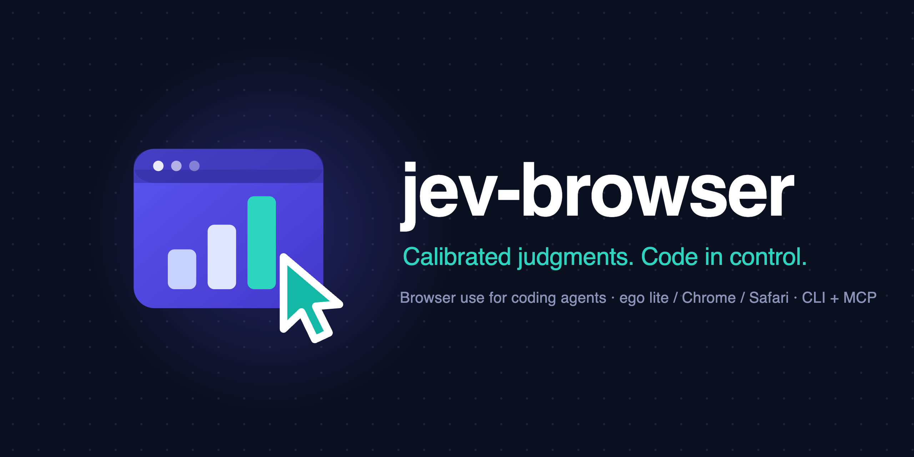
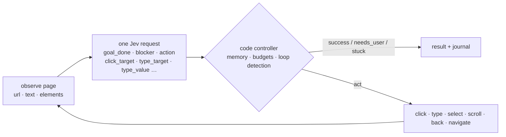

<p align="center">
  
</p>

<h1 align="center">jev-browser</h1>

<p align="center">
  <b>Browser use &amp; computer use for coding agents, powered by TypeSafe Jev.</b><br>
  Calibrated judgments from a System One model. Control loop in code. No vision model, no prompt-and-parse.
</p>

<p align="center">
  <a href="https://github.com/ChenYCL/jev-browser-skill/actions/workflows/test.yml"></a>
  
  
  
  
  
</p>

<p align="center">
  <b>English</b> · <a href="README.zh-CN.md">简体中文</a>
</p>

<p align="center">
  
</p>

---

`jev-browser` accomplishes a natural-language goal in a **real browser**. At every step it
observes the page, asks [Jev](https://typesafe.ai) a handful of small **typed questions in one
request** (is the goal done? is something blocking? what kind of action? which element? which
provided value?), and **code** executes the chosen action, keeps memory, enforces budgets and
decides when to stop. It follows the split popularised by
[NanoJev](https://github.com/TianyuCodings/NanoJev): *atomic judgments from the model, planning
in code.*

```bash
jev-browser run --goal "Open the pricing page and start a free trial of the Team plan" --url https://example.com
```

```
observed https://example.com/ (10 elements)
step 1: goal_done=0.03 blocker=none(0.97) action=click(0.96)   → clicked link 'Pricing'
step 2: goal_done=0.03 blocker=none(0.98) action=click(1.00)   → clicked button 'Start free trial'  (the Team one)
step 3: goal_done=0.98 → success   3 requests · 6.5k tokens · $0.0003 · 3.2 s
```

## Why

| | |
| --- | --- |
| **Works in the user's browser** | Default backend is [ego lite](https://ego.dev): the agent reuses your signed-in sessions, and hands the browser to you when it hits a login, CAPTCHA or consent wall. Resume from the same tab afterwards. |
| **Calibrated, not chatty** | Jev returns probabilities, not prose. Every decision is a number you can threshold, journal and tune. A step costs about **$0.0003** and takes about a second. |
| **Never invents text** | Values that must be typed come from `inputs`; Jev only *selects* among them. `secrets` are typed but never sent to the model or written to disk. |
| **Code stays in control** | Legal actions are filtered in code, tried/blocked edges are remembered, loops are detected, step/cost/time budgets are enforced, and the final page is verified before reporting success. |
| **Fits every agent** | One self-contained skill directory. CLI for Claude Code, Codex, Cursor and any shell-capable agent; a dependency-free **MCP server** for Claude Desktop, Cursor and Codex. |
| **Nothing to install** | Node 22+ and a `TYPESAFE_API_KEY`. Zero npm dependencies. |

## How it works



Per step, one `POST /v1/systemone` carries the page state and the questions below. They are
independent and evaluated in parallel, so speculative ones are asked up front and consumed only
when relevant.

| question | type | used by code as |
| --- | --- | --- |
| `goal_done` | noul | success when ≥ 0.85 (≥ 0.7 on the final verification pass) |
| `blocker` | choice: none · login_required · verification_challenge · consent_or_permission_dialog · error_page · missing_information | `needs_user` when a non-none option ≥ 0.6 |
| `action` | choice over the **legal** actions only (click · type · select · scroll · go_back · navigate · wait · stop) | preference order |
| `click_target` / `type_target` / `select_target` | choice over element ids + `none` | which element |
| `type_value` | choice over input keys + `none` | which provided value |
| `submit_after_type` | noul | press Enter after typing |
| `progress` | score: moved away · no change · closer · accomplished | go back on regression |

Full details: [`references/questions.md`](skills/jev-browser/references/questions.md).

## Quick start

```bash
git clone https://github.com/ChenYCL/jev-browser-skill.git && cd jev-browser-skill
export TYPESAFE_API_KEY=...        # https://console.typesafe.ai
node skills/jev-browser/bin/jev-browser.mjs doctor      # key, API, ego lite, Chrome, Safari, install status
node skills/jev-browser/bin/jev-browser.mjs install     # link into every agent + register Claude Desktop MCP
```

Optional: `npm i -g .` puts `jev-browser` on your `PATH` (the examples below assume it).

## Install into your agents

`install` is idempotent, previews with `--dry-run`, backs up every file it edits and reverts with `--uninstall`.

| target | what it does | default |
| --- | --- | :---: |
| `claude-code` | symlink `~/.claude/skills/jev-browser` | ✔ |
| `codex` | symlink `~/.codex/skills/jev-browser` | ✔ |
| `agents` | symlink `~/.agents/skills/jev-browser` (skills.sh convention: Codex, opencode, Gemini CLI, …) | ✔ |
| `cursor` | symlink `~/.cursor/skills/jev-browser` | ✔ |
| `claude-desktop` | `mcpServers.jev-browser` in `claude_desktop_config.json` | ✔ |
| `cursor-mcp` | `mcpServers.jev-browser` in `~/.cursor/mcp.json` | |
| `codex-mcp` | `[mcp_servers.jev-browser]` in `~/.codex/config.toml` | |

```bash
jev-browser install --targets claude-code,claude-desktop --dry-run
```

Other routes:

- **Claude Code plugin**: `claude plugin marketplace add ChenYCL/jev-browser-skill` then `claude plugin install jev-browser@jev-browser-skill`
- **skills.sh**: `npx skills add ChenYCL/jev-browser-skill --skill jev-browser`
- **Manual**: copy `skills/jev-browser/` anywhere your agent reads skills from.
- **Windows**: prefer `install --copy` (symlinks need Developer Mode or elevation).

MCP hosts start servers without your shell environment, so the installer stores the key in
`~/.config/jev-browser/config.json` (mode 0600) when `TYPESAFE_API_KEY` is exported. Restart the host afterwards.

## Usage

```bash
# navigate
jev-browser run --goal "Open the pricing page" --url https://example.com

# type a provided value, then press Enter (Jev decides when Enter is the natural submit)
jev-browser run --goal 'Search the catalog for "blue widget" and open its product page' \
  --url https://shop.example.com --input query="blue widget"

# sign in: the email is an input, the password is a secret (typed, never sent to the model)
jev-browser run --goal "Sign in and reach the dashboard" --url https://app.example.com/login \
  --input email=ada@example.com --secret password=hunter2

# dedicated headless Chrome, JSON result only
jev-browser run --goal "Add the Red Gadget to the cart" --url https://shop.example.com \
  --backend chrome --headless --json --screenshot /tmp/cart.png

# look before acting: the page exactly as Jev sees it / the first-step questions without spending a request
jev-browser observe --url https://example.com --json
jev-browser run --dry-run --goal "…" --url https://example.com

# raw Jev judgments, browser-independent
jev-browser judge --state '{"ticket":"My card was charged twice"}' \
  --questions '{"refund":{"type":"noul","instructions":"Does `ticket` ask for a refund?"}}'
jev-browser pick --question "Which link opens the plans page?" --candidate pricing="link 'Pricing'" --candidate docs="link 'Docs'"
```

Tips that matter: write goals in English describing the **end state**; put everything that
must be typed in `--input` (quoted strings in the goal are added automatically); use `--secret`
for credentials.


### CLI reference

| command | purpose |
| --- | --- |
| `run` | accomplish a goal (`--goal`, `--url`, `--input k=v`…, `--secret k=v`…) |
| `observe` | print the page as Jev sees it (`--url`, `--screenshot`) |
| `judge` | raw System One call (`--state` / `--state-file`, `--questions` / `--questions-file`, `--model`) |
| `pick` | one Choice over named candidates (`--question`, `--candidate id=desc`…, `--context`, `--no-none`) |
| `doctor` | environment check (`--offline` skips the live API probe, `--json`) |
| `config` | `show` · `path` · `set <key.path> <value>` · `unset <key.path>` · `set-key [<key> \| --from-env]` |
| `install` | `--targets a,b` · `--dry-run` · `--copy` (copy instead of symlink; use on Windows) · `--uninstall` · `--home <dir>` |
| `mcp` | MCP server over stdio |

`run` options: `-g/--goal` · `-u/--url` · `-i/--input` · `-s/--secret` · `-b/--backend ego\|chrome\|safari` ·
`--max-steps` · `--budget-usd` · `--max-ms` · `--model` · `--space-id` and `--page-label` (ego: resume a
task space) · `--keep` / `--no-keep` (leave the final page open; default keep on success) · `--headless` ·
`--cdp-url` (chrome: attach) · `--screenshot <file>` · `--dry-run` · `--journal-dir <dir>` · `--no-journal` ·
`--json` · `-q/--quiet`. `jev-browser --help` prints the same list.

### Results

| status | meaning | exit |
| --- | --- | :---: |
| `success` | goal verified on the final page | 0 |
| `needs_user` | blocker detected; on ego the tab was handed to you. Continue with `--space-id <id>` | 3 |
| `stuck` | repeated no-effect actions, a loop, or Jev judged nothing listed helps | 2 |
| `max_steps` · `budget_exhausted` · `timeout` | a limit was hit (`--max-steps 25`, `--budget-usd 0.25`, `--max-ms 300000`) | 2 |
| `error` | backend or API failure | 2 |

Every run writes `<journalDir>/<runId>/steps.jsonl` (state hash, compact answers, chosen action,
whether the page changed, cost), `requests.jsonl` and `run.json`, with secrets redacted.

### Backends

| backend | when | notes |
| --- | --- | --- |
| `ego` (default) | you want the agent in **your** browser with your logins, and the option to take over | keeps the result tab open on success; `handOff` on blockers; resume with `--space-id` |
| `chrome` | unattended runs, CI, no window | own profile dir, `--headless`, or `--cdp-url http://127.0.0.1:9222` to attach |
| `safari` | WebKit | enable Develop → Allow Remote Automation once |

## MCP server

`jev-browser mcp` speaks MCP over stdio with zero dependencies. Tools: `jev_browse`, `jev_observe`,
`jev_judge`, `jev_pick`, `jev_doctor`, `jev_config`. Results come back as JSON text and
`structuredContent`. See [`references/mcp.md`](skills/jev-browser/references/mcp.md).

## Configuration

Precedence: defaults → `~/.config/jev-browser/config.json` → `./jev-browser.config.json` (or
`$JEV_BROWSER_CONFIG`) → environment → flags.

```bash
jev-browser config show
jev-browser config set model jev-1.13.0            # pin the model version
jev-browser config set thresholds.goalDone 0.9     # stricter success
jev-browser config set-key --from-env              # persist the key for MCP hosts
```

Environment: `TYPESAFE_API_KEY` `TYPESAFE_BASE_URL` `TYPESAFE_DEFAULT_MODEL` `JEV_BROWSER_BACKEND`
`JEV_BROWSER_MAX_STEPS` `JEV_BROWSER_BUDGET_USD` `JEV_BROWSER_JOURNAL_DIR` `JEV_BROWSER_CHROME_CDP_URL`
`JEV_BROWSER_HEADLESS` `JEV_BROWSER_EGO_SERVER_NAME` `CHROME_PATH` (Chrome executable override)
`JEV_BROWSER_CONFIG` (explicit project config file). Every key is documented in
[`references/config.md`](skills/jev-browser/references/config.md).

## Tests and stability

```bash
npm test                      # unit + e2e; live Jev when TYPESAFE_API_KEY is set, else a local mock
npm run test:e2e:mock         # fully offline (needs Chrome)
JEV_BROWSER_TEST_SAFARI=1 npm run test:e2e   # also drive Safari
```

The e2e suite serves a fixture site (catalog, search, login, pricing/trial, cart, contact form
with a dropdown, long docs page, restricted area) and runs nine goal scenarios per backend:
navigation, search with typed input, login with a secret, choosing the right one of three
identical "Start free trial" buttons, add to cart, form + dropdown, scroll to reveal, hand-off on
a blocker, limits on an impossible goal, plus observe/dry-run, the CLI round-trip and ego
hand-off → resume. Tests never write outside the repo.

Measured on macOS with live Jev (2026-09-22):

| | |
| --- | --- |
| full suite | 54 passed, 0 failed, 5 skipped (Safari opt-in), ~40 s, three consecutive runs identical |
| per-scenario determinism | same status every run; step counts identical on ego, ±1 on two Chrome scenarios |
| cost | $0.00006–0.00094 per scenario run (always under $0.001), about $0.02 per full suite |
| line coverage | 87 % overall (controller 92 %, questions/config/util 100 %, observe 99.6 %) |

Real sites, first try, via ego lite: TypeSafe docs → the *Choice* page in 2 steps / 9 s / $0.0005;
GitHub → `docs/ATOMIC_PLANNING.md` in NanoJev in 4 steps / 23 s / $0.0016.

## What leaves your machine

Each step sends one request to `api.typesafe.ai` containing the goal, the non-secret `inputs`, and a
compact view of the current page: URL, title, headings, up to `observation.maxTextChars` (3000) of
visible text, the descriptions of listed interactive elements (role, name, href, placeholder,
current value), the previous page's excerpt and the last action. Nothing else is sent: no
screenshots, no cookies, no HTML, no `secrets` (their values are replaced by a fixed marker, and
password fields report `(hidden)`). Journals stay local under `journalDir` with secrets redacted.
TypeSafe states that API requests are not used for training; see their
[legal page](https://docs.typesafe.ai/legal). Pin a model version with `config set model jev-1.13.0`
if reproducibility matters.

## Design notes

- **Dynamic legal moves.** Like NanoJev's Snake controller, code filters the action set
  (no `scroll_down` at the bottom, no `type` without inputs) and the model breaks ties.
- **Edge memory.** `(page state, action)` pairs that produced no change are blocked; pairs
  already tried are deprioritised, so A → B → back → A does not repeat forever.
- **Select, don't generate.** Typed values, dropdown options and URLs are chosen from candidates
  supplied by code; Jev 1.13 reads literally and does not generate text.
- **Speculative fan-out.** All questions of a step go in one request; unused answers are free
  in latency and cheap in tokens.
- **Verification before success.** Success needs `goal_done ≥ 0.85` on the *current* page, and
  a final check runs when the step budget ends.

## Limitations

- Same-origin iframes are not enumerated; clicks that open a new tab are not followed.
- Canvas apps, drag and drop, file uploads and hover-only menus are not handled.
- Pages with more than `observation.maxCandidates` (100, API max 255) interactive elements
  are truncated; scrolling compensates.
- Safari was implemented against the W3C WebDriver spec but not exercised on a machine with
  remote automation enabled.
- Jev's primary training language is English; translate goals for best accuracy.

## Layout

```
skills/jev-browser/          the skill (self-contained; this is what installers link)
  SKILL.md                   agent-facing instructions
  bin/jev-browser.mjs        CLI + MCP entry point
  lib/controller.mjs         code controller
  lib/questions.mjs          the atomic question set
  lib/observe.mjs            page enumerator shared by all backends
  lib/typesafe.mjs           HTTP client (retry, cost, cache)
  lib/backends/              ego · chrome · safari
  lib/mcp.mjs                MCP stdio server
  references/                questions · config · backends · mcp
tests/                       unit + e2e (fixture site, mock TypeSafe, per-backend scenarios)
.claude-plugin/ .mcp.json    Claude Code plugin packaging
```

## Contributing

Issues and PRs are welcome. `npm test` must stay green in mock mode (no key needed); add a
fixture page and a scenario in `tests/e2e/scenarios.mjs` for new behaviours. Question wording
and thresholds live in `lib/questions.mjs` and `lib/config.mjs`; keep them in one place.

## Credits

[TypeSafe](https://typesafe.ai) for Jev and the System One API ·
[NanoJev](https://github.com/TianyuCodings/NanoJev) for the atomic-judgments-plus-code-planning design ·
[ego lite](https://ego.dev) for a browser built for humans and agents together.

## License

MIT
