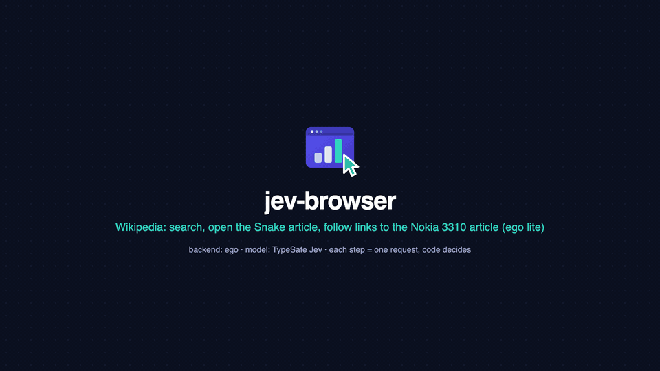
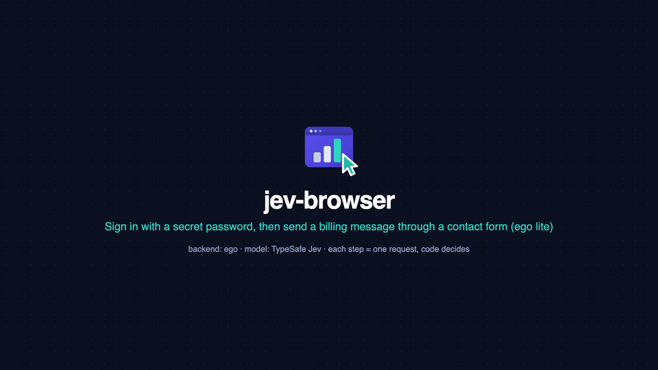
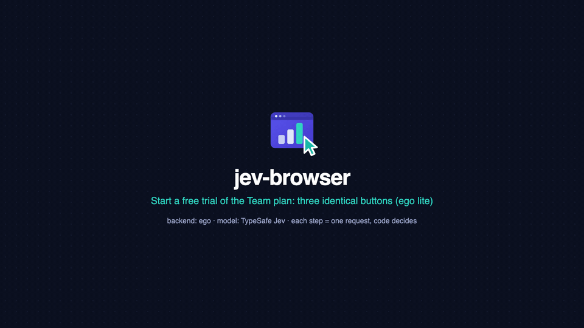
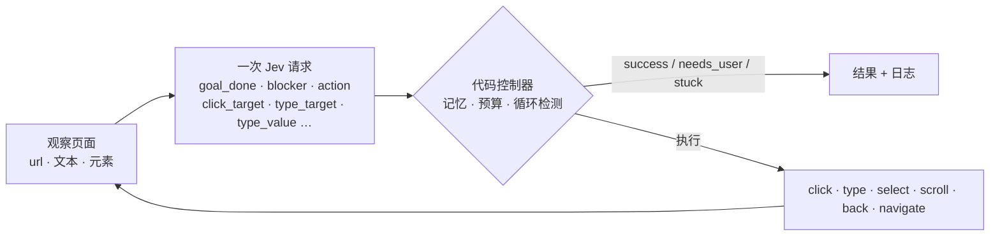

<p align="center">
  
</p>

<h1 align="center">jev-browser</h1>

<p align="center">
  <b>给编码 Agent 用的浏览器操作 / computer use，由 TypeSafe Jev 驱动。</b><br>
  System One 模型给出带概率的判断，控制循环由代码掌握。不需要视觉模型，没有 prompt-and-parse。
</p>

<p align="center">
  <a href="https://github.com/ChenYCL/jev-browser-skill/actions/workflows/test.yml"></a>
  
  
  
  
  
</p>

<p align="center">
  <a href="README.md">English</a> · <b>简体中文</b>
</p>

<p align="center">
  
</p>

---

## 演示

在 **ego lite** 里的真实运行，由工具自己录制（`run --step-screenshots`）。左边是每一步之前 Jev 看到的页面，右边是 Jev 对这一步的校准判断以及代码控制器执行的动作。每个演示都只是一条 `jev-browser run` 命令。

**Wikipedia 真实站点多跳**：在搜索框输入并回车、选中正确的结果、跨三篇文章跟链接（500 多个链接的长页面，靠"目标关键词优先"的候选排序把相关链接留在列表里）。6 步 · $0.0029 · 21 s。[▶ MP4 1080p](assets/demo-wikipedia.mp4)

<p align="center">
  
</p>

**用密钥登录，再填一个带下拉框的表单**：密码会被输入，但 Jev 只看到 `inputs.password` 这个名字；下拉框的选项由第二个问题从选项列表里选出。10 步 · $0.0013 · 18 s。[▶ MP4 1080p](assets/demo-form.mp4)

<p align="center">
  
</p>

**三个一模一样的 "Start free trial" 按钮**：目标只说了 Team 方案，Jev 仅凭页面结构以 1.00 的概率选中正确的那个。3 步 · $0.0003 · 3 s。[▶ MP4 1080p](assets/demo-team-plan.mp4) · 另有：[GitHub 仓库导航（MP4）](assets/demo-github.mp4)

<p align="center">
  
</p>

GitHub 不会内联播放仓库里的 MP4，所以上面的 GIF 是预览，MP4 才是完整画质（1080p、带转场）。任何带 `--step-screenshots <dir>` 的运行都可以用 `node scripts/make-demo.mjs <run.json> out.mp4 --gif out.gif` 复现。

## 为什么用它

| | |
| --- | --- |
| **在你自己的浏览器里工作** | 默认后端是 [ego lite](https://ego.dev)：Agent 复用你已登录的会话；遇到登录、验证码、同意弹窗时把标签页交还给你，处理完后从同一个标签页续跑。 |
| **给的是概率，不是废话** | Jev 返回校准过的概率而非文本。每个决定都是一个可以设阈值、可以记日志、可以调优的数字。一步约 **$0.0003**、约 1 秒。 |
| **从不编造文本** | 需要输入的值来自 `inputs`，Jev 只在其中**选择**。`secrets` 会被输入，但永远不发给模型、不落盘。 |
| **代码始终掌控** | 合法动作在代码里过滤，试过 / 无效的动作被记住，循环被检测，步数 / 费用 / 时间都有预算，报告成功前会核验最终页面。 |
| **接入所有主流 Agent** | 一个自包含的 skill 目录。CLI 给 Claude Code、Codex、Cursor 及任何能跑 shell 的 Agent；无依赖的 **MCP server** 给 Claude Desktop、Cursor、Codex。 |
| **零安装** | 只需 Node 22+ 和一个 `TYPESAFE_API_KEY`。没有任何 npm 依赖。 |

## 工作原理



每一步只发一次 `POST /v1/systemone`，携带页面状态和下面这组问题。问题之间相互独立、并行评估，所以投机性的问题（比如"如果要点击，点哪个"）会一次问完，用到时才消费。

| 问题 | 类型 | 代码怎么用 |
| --- | --- | --- |
| `goal_done` | noul | ≥ 0.85 判成功（最终核验时 ≥ 0.7） |
| `blocker` | choice：none · login_required · verification_challenge · consent_or_permission_dialog · error_page · missing_information | 非 none 项 ≥ 0.6 → `needs_user` |
| `action` | choice，只包含**当前合法**的动作（click · type · select · scroll · go_back · navigate · wait · stop） | 动作优先顺序 |
| `click_target` / `type_target` / `select_target` | choice，元素 id + `none` | 选哪个元素 |
| `type_value` | choice，输入项的键 + `none` | 填哪个给定值 |
| `submit_after_type` | noul | 输入后是否回车 |
| `progress` | score：远离 · 无变化 · 更近 · 已完成 | 倒退时回退 |

细节见 [`references/questions.md`](skills/jev-browser/references/questions.md)。

## 快速开始

```bash
git clone https://github.com/ChenYCL/jev-browser-skill.git && cd jev-browser-skill
export TYPESAFE_API_KEY=...        # https://console.typesafe.ai
node skills/jev-browser/bin/jev-browser.mjs doctor      # 检查 key、API、ego lite、Chrome、Safari、安装状态
node skills/jev-browser/bin/jev-browser.mjs install     # 软链到所有 Agent + 注册 Claude Desktop MCP
```

可选：`npm i -g .` 把 `jev-browser` 命令加到 `PATH`（下文示例默认已加）。

## 安装到各个 Agent

`install` 可重复执行，`--dry-run` 预览，改动任何文件前自动备份，`--uninstall` 整体回退。

| target | 做什么 | 默认 |
| --- | --- | :---: |
| `claude-code` | 软链 `~/.claude/skills/jev-browser` | ✔ |
| `codex` | 软链 `~/.codex/skills/jev-browser` | ✔ |
| `agents` | 软链 `~/.agents/skills/jev-browser`（skills.sh 通用目录：Codex、opencode、Gemini CLI 等） | ✔ |
| `cursor` | 软链 `~/.cursor/skills/jev-browser` | ✔ |
| `claude-desktop` | 写入 `claude_desktop_config.json` 的 `mcpServers.jev-browser` | ✔ |
| `cursor-mcp` | 写入 `~/.cursor/mcp.json` 的 `mcpServers.jev-browser` | |
| `codex-mcp` | 写入 `~/.codex/config.toml` 的 `[mcp_servers.jev-browser]` | |

```bash
jev-browser install --targets claude-code,claude-desktop --dry-run
```

其他方式：

- **Claude Code 插件**：`claude plugin marketplace add ChenYCL/jev-browser-skill`，再 `claude plugin install jev-browser@jev-browser-skill`
- **skills.sh**：`npx skills add ChenYCL/jev-browser-skill --skill jev-browser`
- **手动**：把 `skills/jev-browser/` 复制到你的 Agent 读取 skill 的目录。
- **Windows**：建议 `install --copy`（软链需要开发者模式或管理员权限）。

MCP 宿主启动 server 时没有你的 shell 环境变量，所以 `install` 会在 `TYPESAFE_API_KEY` 已导出时把 key 存进
`~/.config/jev-browser/config.json`（权限 0600）。注册后重启宿主。

## 用法

```bash
# 导航
jev-browser run --goal "Open the pricing page" --url https://example.com

# 输入给定的值，再回车（是否回车由 Jev 判断）
jev-browser run --goal 'Search the catalog for "blue widget" and open its product page' \
  --url https://shop.example.com --input query="blue widget"

# 登录：邮箱是 input，密码是 secret（会被输入，但永远不发给模型）
jev-browser run --goal "Sign in and reach the dashboard" --url https://app.example.com/login \
  --input email=ada@example.com --secret password=hunter2

# 独立的无头 Chrome，只输出 JSON
jev-browser run --goal "Add the Red Gadget to the cart" --url https://shop.example.com \
  --backend chrome --headless --json --screenshot /tmp/cart.png

# 先看再动：Jev 眼中的页面 / 第一步会问的问题（不花请求）
jev-browser observe --url https://example.com --json
jev-browser run --dry-run --goal "…" --url https://example.com

# 与浏览器无关的原始 Jev 判断
jev-browser judge --state '{"ticket":"My card was charged twice"}' \
  --questions '{"refund":{"type":"noul","instructions":"Does `ticket` ask for a refund?"}}'
jev-browser pick --question "Which link opens the plans page?" --candidate pricing="link 'Pricing'" --candidate docs="link 'Docs'"
```

要点：目标用**英文**描述**最终状态**（Jev 的主训练语言是英文，中文可用但精度略低，让 Agent 先翻译）；所有需要输入的内容放进 `--input`（目标里的引号字符串会自动加入）；凭据用 `--secret`。


### CLI 速查

| 命令 | 用途 |
| --- | --- |
| `run` | 完成一个目标（`--goal`、`--url`、`--input k=v`…、`--secret k=v`…） |
| `observe` | 打印 Jev 眼中的页面（`--url`、`--screenshot`） |
| `judge` | 原始 System One 调用（`--state` / `--state-file`、`--questions` / `--questions-file`、`--model`） |
| `pick` | 在命名候选里做一次 Choice（`--question`、`--candidate id=desc`…、`--context`、`--no-none`） |
| `doctor` | 环境检查（`--offline` 跳过在线 API 探测，`--json`） |
| `config` | `show` · `path` · `set <key.path> <value>` · `unset <key.path>` · `set-key [<key> \| --from-env]` |
| `install` | `--targets a,b` · `--dry-run` · `--copy`（复制而非软链，Windows 请用它）· `--uninstall` · `--home <dir>` |
| `mcp` | 通过 stdio 提供 MCP server |

`run` 的参数：`-g/--goal` · `-u/--url` · `-i/--input` · `-s/--secret` · `-b/--backend ego\|chrome\|safari` ·
`--max-steps` · `--budget-usd` · `--max-ms` · `--model` · `--space-id` 与 `--page-label`（ego：续跑某个 task space）·
`--keep` / `--no-keep`（结果页是否保留，默认成功即保留）· `--headless` · `--cdp-url`（chrome：附着已有实例）·
`--screenshot <file>` · `--step-screenshots <dir>`（每步一张 PNG，Jev 看到的页面）· `--dry-run` · `--journal-dir <dir>` · `--no-journal` · `--json` · `-q/--quiet`。
`jev-browser --help` 输出同样的列表。

### 结果

| status | 含义 | 退出码 |
| --- | --- | :---: |
| `success` | 最终页面核验目标已达成 | 0 |
| `needs_user` | 检测到阻碍；ego 后端已把标签页交给你，处理后用 `--space-id <id>` 续跑 | 3 |
| `stuck` | 连续无效动作、循环，或 Jev 判断没有可用动作 | 2 |
| `max_steps` · `budget_exhausted` · `timeout` | 触到上限（`--max-steps 25`、`--budget-usd 0.25`、`--max-ms 300000`） | 2 |
| `error` | 后端或 API 故障 | 2 |

每次运行写 `<journalDir>/<runId>/steps.jsonl`（状态哈希、压缩后的答案、所选动作、页面是否变化、费用）、`requests.jsonl` 和 `run.json`，密钥已脱敏。

### 后端

| 后端 | 适用 | 说明 |
| --- | --- | --- |
| `ego`（默认） | 希望 Agent 在**你的**浏览器里用你的登录态，并且随时可以接管 | 成功后结果页保留；阻碍时 `handOff`；`--space-id` 续跑 |
| `chrome` | 无人值守、CI、不要窗口 | 独立 profile；`--headless`；或 `--cdp-url http://127.0.0.1:9222` 附着到已开启调试端口的 Chrome |
| `safari` | WebKit | 需在开发菜单打开一次"允许远程自动化" |

### 判定后端（tier）

三种判定后端共用同一个 `/v1/systemone` 契约，都是平级选项 —— 但**默认仍然是托管版 Jev**：不写配置、不设环境变量，运行走 `https://api.typesafe.ai`（loopback `baseUrl` 即本地模型，按 $0 计价）。

```bash
jev-browser tier list      # 三个 tier：是什么、需要什么、怎么启动、端口、得分、goal_done 阈值
jev-browser tier status    # 当前一次运行会用哪个：baseUrl、tier、解析出的阈值、端点状态
jev-browser tier use kev   # 打印某个 tier 的 export 行和启动命令（除非加 --persist，否则不写配置）
```

表格与全部实测数字（得分、延迟、磁盘、内存、各后端 `goal_done` 阈值、已知短板）见
[`SKILL.md`](skills/jev-browser/SKILL.md#judging-tiers)；`references/config.md` 只保留阈值 profile 细节。

## MCP server

`jev-browser mcp` 通过 stdio 提供 MCP，零依赖。工具：`jev_browse`、`jev_observe`、`jev_judge`、`jev_pick`、`jev_doctor`、`jev_config`。结果同时以 JSON 文本和 `structuredContent` 返回。见 [`references/mcp.md`](skills/jev-browser/references/mcp.md)。

## 配置

优先级：默认值 → `~/.config/jev-browser/config.json` → `./jev-browser.config.json`（或 `$JEV_BROWSER_CONFIG`）→ 环境变量 → 命令行参数。

```bash
jev-browser config show
jev-browser config set model jev-1.13.0            # 固定模型版本
jev-browser config set thresholds.goalDone 0.9     # 更严格的成功阈值
jev-browser config set-key --from-env              # 给 MCP 宿主持久化 key
```

环境变量：`TYPESAFE_API_KEY` `TYPESAFE_BASE_URL` `TYPESAFE_DEFAULT_MODEL` `JEV_BROWSER_BACKEND`
`JEV_BROWSER_MAX_STEPS` `JEV_BROWSER_BUDGET_USD` `JEV_BROWSER_JOURNAL_DIR` `JEV_BROWSER_CHROME_CDP_URL`
`JEV_BROWSER_HEADLESS` `JEV_BROWSER_EGO_SERVER_NAME` `CHROME_PATH`（指定 Chrome 可执行文件）
`JEV_BROWSER_CONFIG`（指定项目配置文件）。全部键见 [`references/config.md`](skills/jev-browser/references/config.md)。

## 测试与稳定性

```bash
npm test                      # 单元 + e2e；有 TYPESAFE_API_KEY 用真实 Jev，否则用本地 mock
npm run test:e2e:mock         # 完全离线（需要 Chrome）
JEV_BROWSER_TEST_SAFARI=1 npm run test:e2e   # 同时驱动 Safari
```

CI（`.github/workflows/test.yml`）在 Ubuntu 上用无头 Chrome 跑单元测试和 mock e2e；真实 Jev 的套件只在本地跑，云端不需要也不存放任何 API key。

e2e 套件会起一个 fixture 站点（商品目录、搜索、登录、定价 / 试用、购物车、含下拉框的联系表单、超长文档页、受限区域），对每个后端跑 9 个目标场景：导航、输入并搜索、用密钥登录、在三个同名 "Start free trial" 按钮里选对的、加购、表单 + 下拉框、滚动找按钮、遇阻碍交接、不可能目标的上限；另有 observe / dry-run、CLI 全流程、ego 交接 → 续跑。测试不会往仓库之外写任何文件。

在 macOS 上用真实 Jev 的实测数据（2026-09-22）：

| | |
| --- | --- |
| 完整套件 | 54 通过、0 失败、5 跳过（Safari 需自行开启），约 40 s，连续三次结果完全一致 |
| 逐场景确定性 | 每次状态相同；ego 上步数完全一致，Chrome 上两个场景 ±1 步 |
| 费用 | 单场景 < $0.001，整套 e2e 约 $0.02 |
| 行覆盖率 | 整体 87 %（controller 92 %，questions / config / util 100 %，observe 99.6 %） |

真实网站首次即成功（ego lite）：TypeSafe 文档站 → *Choice* 页，2 步 / 9 s / $0.0005；GitHub → NanoJev 仓库的 `docs/ATOMIC_PLANNING.md`，4 步 / 23 s / $0.0016。

## 哪些数据会离开本机

每一步向 `api.typesafe.ai` 发一次请求，内容是：目标、非密钥的 `inputs`、当前页面的精简视图（URL、标题、标题层级、最多 `observation.maxTextChars`（3000）字符的可见文本、已列出的可交互元素描述：角色、名称、链接、占位符、当前值）、上一页摘要和上一步动作。除此之外什么都不发：没有截图、没有 cookie、没有 HTML、没有 `secrets`（其值被替换成固定标记，密码框的值显示为 `(hidden)`）。日志只留在本机的 `journalDir`，密钥已脱敏。TypeSafe 声明 API 请求不用于训练，见其[法律页面](https://docs.typesafe.ai/legal)。需要可复现时用 `config set model jev-1.13.0` 固定模型版本。

## 设计要点

- **动态合法动作**：像 NanoJev 的贪吃蛇控制器一样，代码先过滤动作集合（到底了就没有 `scroll_down`，没有输入项就没有 `type`），模型只在合法动作里做选择。
- **边记忆**：产生"无变化"的 `(页面状态, 动作)` 会被屏蔽，已试过的会被降权，A → B → 返回 → A 不会无限重复。
- **只选不生成**：输入值、下拉选项、URL 都从代码给出的候选里选；Jev 1.13 按字面理解，不生成文本。
- **目标感知的候选排序**：截断到 `observation.maxCandidates` 之前，代码先把名称 / 链接里含目标关键词的元素排在前面，再按视口、位置排序，长页面深处的相关链接也能进入候选；匹配大多数元素的关键词会被忽略。
- **"大概完成"不等于完成**：模型在 70–85 % 时选 stop，控制器会先多走一步没试过的动作；只有 ≥ 85 %（或没有候选）才结束。
- **投机性并发提问**：一步的所有问题打包成一次请求，没用到的答案几乎不增加延迟。
- **成功前核验**：成功要求**当前页面**的 `goal_done ≥ 0.85`；步数用尽时再做一次最终核验。

## 已知限制

- 不枚举同源 iframe 内容；点击后新开的标签页不会跟进。
- 不处理 canvas 应用、拖拽、文件上传、仅 hover 的菜单。
- 可交互元素超过 `observation.maxCandidates`（默认 100，API 上限 255）会被截断，靠滚动补救。
- Safari 后端按 W3C WebDriver 规范实现，但尚未在开启远程自动化的机器上实测。
- Jev 主训练语言为英文，目标请翻译成英文以获得最佳精度。

## 目录结构

```
skills/jev-browser/          skill 本体（自包含；安装器软链的就是它）
  SKILL.md                   给 Agent 看的说明
  bin/jev-browser.mjs        CLI + MCP 入口
  lib/controller.mjs         代码控制器
  lib/questions.mjs          原子问题集
  lib/observe.mjs            所有后端共用的页面枚举器
  lib/typesafe.mjs           HTTP 客户端（重试、计费、缓存）
  lib/backends/              ego · chrome · safari
  lib/mcp.mjs                MCP stdio server
  references/                questions · config · backends · mcp
tests/                       单元 + e2e（fixture 站点、mock TypeSafe、逐后端场景）
.claude-plugin/ .mcp.json    Claude Code 插件打包
```

## 参与贡献

欢迎 issue 和 PR。`npm test` 在 mock 模式下（不需要 key）必须保持通过；新行为请在 `tests/e2e/scenarios.mjs` 加场景并补 fixture 页面。问题措辞与阈值集中在 `lib/questions.mjs` 和 `lib/config.mjs`，请保持在一处。

## 致谢

[TypeSafe](https://typesafe.ai) 提供 Jev 与 System One API ·
[NanoJev](https://github.com/TianyuCodings/NanoJev) 提供"原子判断 + 代码规划"的设计 ·
[ego lite](https://ego.dev) 提供为人与 Agent 共用而设计的浏览器。

## 许可证

MIT
